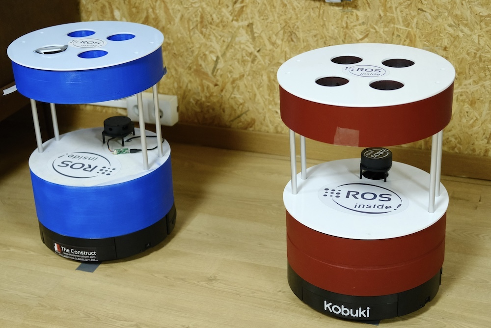

# CheckPoint 4 ROS2 Fundamentals

<a name="readme-top"></a>

## About The Project
This project is about one robot must attempt to escape, while the other robot utilizes the TF frames to locate and track it. With the help of the TF tree, the pursuing robot can accurately identify the position of the escaping robot and give chase. To achieve this, a robot model ws created using URDF and subsequently refactor it using XACRO macros. Additionally, an algorithm that enables a robot to pursue and follow another robot that is attempting to evade capture was implemented.



<!-- GETTING STARTED -->
## Getting Started

### Software Prerequisites
* Ubuntu 22.04
* ROS2 Humble

<p align="right">(<a href="#readme-top">back to top</a>)</p>

<!-- INSTALLATION -->
### Installation
1. Clone the repo:
   ```sh
   cd ~ && \
   git clone https://github.com/pvela2017/The-Construct-CheckPoint-4-ROS2-Fundamentals
   ```
2. Download additional files:
   ```sh
   cd ~/The-Construct-CheckPoint-4-ROS2-Fundamentals/ros2_ws/src && \
   git clone https://bitbucket.org/theconstructcore/checkpoint4_auxiliary_files.git
   ```
     
<p align="right">(<a href="#readme-top">back to top</a>)</p>


<!-- USAGE -->
## Usage
### Local Simulation
1. Compile and launch the simulation:
   ```sh
   cd ~/The-Construct-CheckPoint-4-ROS2-Fundamentals/ros2_ws && \
   colcon build && \
   source install/setup.bash && \
   ros2 launch barista_robot_description barista_two_robots.launch.py
   ```
2. Launch the chasing algorithm:
   ```sh
   source ~/The-Construct-CheckPoint-4-ROS2-Fundamentals/ros2_ws/install/setup.bash && \
   ros2 run robot_chase robot_chase
   ```
3. Move the robot:
   ```sh
   ros2 run teleop_twist_keyboard teleop_twist_keyboard --ros-args --remap cmd_vel:=/robot2/cmd_vel
   ```

<p align="right">(<a href="#readme-top">back to top</a>)</p>


<!-- KEYS -->
## Key Topics Learnt
* URDF & XACRO.
* Simulation of multiple robots.
* Gazebo plugins.
* Publish TFs.
